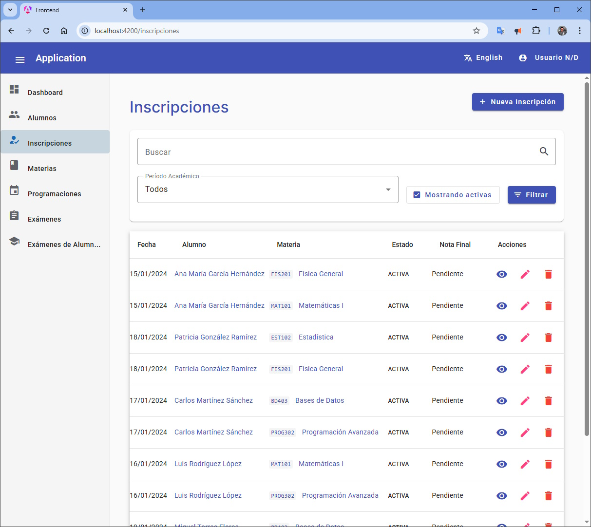

## Introducción

Aplicación Full Stack diseñada para la administración completa de alumnos, materias y exámenes en un entorno educativo.

## Estructura General de la Solución

La aplicación está organizada en tres componentes principales:

```
./
├── backend/         # Aplicación WebAPI en .NET Core 8
├── frontend/        # Aplicación SPA en Angular 19
└── documentación/   # Documentación técnica y de usuario
```

## Arquitectura de la Aplicación

La solución sigue una arquitectura como se describe:


1. **Capa de Presentación** (Frontend Angular)
   - Componentes visuales y lógica de presentación
   - Interacción con el usuario
   - Comunicación con la API mediante servicios

2. **Capa de API** (Backend .NET Core)
   - Controllers para exponer endpoints REST
   - Validación de datos de entrada
   - Orquestación de operaciones de negocio

3. **Capa de Lógica de Negocio** (Backend)
   - Servicios para implementar reglas de negocio
   - Procesamiento de datos

4. **Capa de Acceso a Datos** (Backend)
   - Repositorios para interactuar con la base de datos
   - Stored Procedures para operaciones complejas
   - Mapeo entre entidades y objetos de dominio

5. **Capa de Datos** (SQL Server)
   - Almacenamiento persistente de información
   - Procedimientos almacenados
   - Estructura relacional

## Flujos de Trabajo Principales

La estructura de la base de datos es la siguiente:


1. **Gestión de Alumnos**
   - Alta, baja y modificación de datos de alumnos
   - Consulta de historial académico

2. **Gestión de Materias**
   - Creación y configuración de materias
   - Asignación de requisitos y contenidos

3. **Programación de Exámenes**
   - Creación de programaciones de exámenes
   - Asignación de fecha, hora, aula y material requerido
   - Seguimiento del estado de las programaciones

4. **Inscripción de Alumnos**
   - Registro de alumnos en materias
   - Visualización de inscripciones por materia/alumno

5. **Gestión de Evaluaciones**
   - Registro de exámenes realizados
   - Calificación de exámenes
   - Consulta de resultados académicos


## Backend


### Tecnologías Utilizadas

- **Framework**: .NET Core 8 (WebAPI)
- **Arquitectura**: REST API
- **Acceso a Datos**: 
  - Stored Procedures para interacción con SQL Server
  - Dapper como micro-ORM
  - Repositorios que devuelven listas a los controllers
- **Mapeo de Objetos**: AutoMapper
- **Base de Datos**: SQL Server

### Características Principales

- API RESTful con endpoints para todas las entidades del sistema
- Patrón repositorio para separación de lógica de acceso a datos
- Validación de datos en el servidor
- Manejo centralizado de errores
- Documentación de API con Swagger

## Frontend


### Tecnologías Utilizadas

- **Framework**: Angular 19.2.0
- **Componentes UI**: Angular Material 19.2.6
- **Estilo**: SCSS para estilos personalizados
- **Gestión de Estado**: Servicios de Angular y RxJS

### Características Principales

- Aplicación SPA (Single Page Application)
- Diseño responsive
- Formularios reactivos para la entrada de datos
- Navegación entre componentes con Angular Router
- Interfaz de usuario intuitiva con Angular Material


### Módulos Principales


1. **Alumnos**

  

   - Lista de alumnos
   - Detalles de alumno
   - Formulario de alta/edición de alumnos

2. **Materias**

  

   - Lista de materias
   - Detalles de materia
   - Formulario de alta/edición de materias

3. **Exámenes**

  

   - Lista de exámenes
   - Detalles de examen
   - Formulario de alta/edición de exámenes

4. **Programaciones de Examen**

  

   - Lista de programaciones
   - Detalles de programación
   - Formulario de alta/edición de programaciones

5. **Inscripciones**

  

   - Gestión de inscripciones de alumnos a materias
   - Visualización de inscripciones por alumno/materia

6. **Alumno-Exámenes**

  

   - Registro de exámenes realizados por alumnos
   - Calificación de exámenes
   - Consulta de resultados


### Base de datos

El aplicativo interactua con SQL Server a través de store procedures


